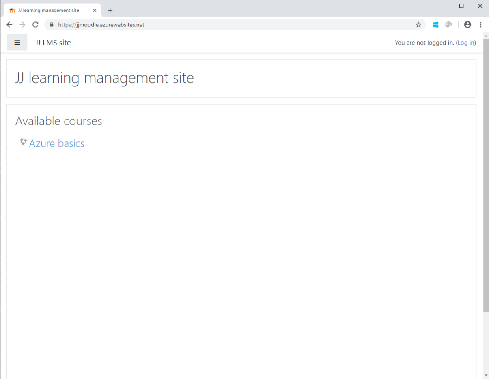
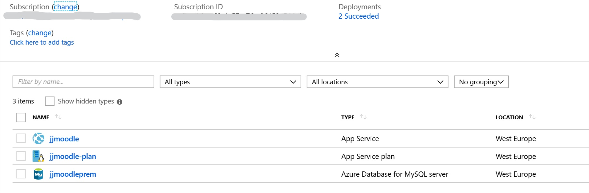
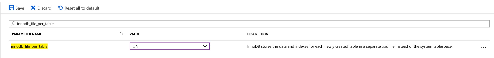

# JJ web running LMS Moodle

What is Moodle ? [Open-source Learning platform](https://moodle.org/)

This repository describes how to run Moodle on Azure platform services. Deployment will use Azure Database for MySql and Azure WebApp for hosting Docker. For running Docker Moodle image you can use other Azure services like Azure Managed Kubernetes or Azure Container Instances.

**Result: WebApp cannot be used because long time of Docker initialization** (see bellow)

If you want to run on virtual machines, simple go to [Azure Marketplace](https://azuremarketplace.microsoft.com/en-us/marketplace/apps/bitnami.moodle?tab=Overview) and select Moodle.

**Moodle Admin site** after installation


Using this **Azure platform services**



## Create Azure MySql database

Create new Azure Database for MySql, my is jjmoodleprem

- Price tier General Purpose or higher (reason is server parameters settings)
- Connection security: Disable Enforce SSL connection
- Connection security: add you IP address and Allow access to Azure services (for Azure WebApp)
- Change Server parameters innodb_file_per_table = ON



## Run Moodle in Docker locally

Start Dockec Moodle container locally. We will use [Bitnami docker image](https://github.com/bitnami/bitnami-docker-moodle#readme)

```powershell
docker volume create --name moodle_data

docker run -it -p 80:80 -p 443:443 --name moodle `
  -e MARIADB_HOST=jjmoodleprem.mysql.database.azure.com `
  -e MOODLE_DATABASE_USER=jj@jjmoodleprem `
  -e MOODLE_DATABASE_NAME=bitnami_moodle `
  -e MOODLE_DATABASE_PASSWORD=azure-123 `
  -e ALLOW_EMPTY_PASSWORD=no `
  -e NAMI_DEBUG='--log-level=debug' `
  --volume moodle_data:/bitnami bitnami/moodle:latest
```

**It takes min 20mins**, hanging on this line: php     TRACE [runProgram] Executing: /opt/bitnami/php/bin/php admin/cli/install.php
Wait wait...

When finished, you will see: app-entrypoint.sh 18:37:28.67 INFO  ==> Starting moodle...

Start browser on http://localhost (defaul admin username: user, password: bitnami)

### Troubleshooting installation

Run Docker and run inside scripts

```powershell
docker run -it -p 80:80 -p 443:443 --name moodle `
  -e MARIADB_HOST=jjmoodleprem.mysql.database.azure.com `
  -e MOODLE_DATABASE_USER=jj@jjmoodleprem `
  -e MOODLE_DATABASE_NAME=bitnami_moodle `
  -e MOODLE_DATABASE_PASSWORD=azure-123 `
  -e NAMI_DEBUG='--log-level=debug' `
  --volume moodle_data:/bitnami bitnami/moodle:latest "/bin/bash"

docker rm moodle
docker volume rm moodle_data
```

Start installation inside container to get error detail

``` bash
/app-entrypoint.sh nami start
```

If installation fails durring database setup, you can rerun with this command

``` bash
php /opt/bitnami/moodle/admin/cli/install_database.php --lang=en --dataroot=/bitnami/moodle/moodledata --dbtype=mariadb --dbhost=jjmoodleprem.mysql.database.azure.com --dbport=3306 --dbname=bitnami_moodle --dbuser=jj@jjmoodleprem --dbpass=azure-123 --adminuser=user --adminpass=bitnami --adminemail=user@example.com --fullname="New Site" --shortname="New Site" --non-interactive --allow-unstable --agree-license
```

## Run on Azure WebApp

Create new Azure Web App for Containers service, my is jjmoodle

- Price tier P2V2 (S1 was problem to use because long docker start, has been restarted)
- OS Linux
- Configure container with Quickstart Nginx

Check website is running Nginx, my is https://jjmoodle.azurewebsites.net/

Cleanup database (drop schema) or recreate MySql database. We have to recreate state for docker.

When created, start reconfiguration WebApp

- Change Container settings to Docker Compose

```yaml
version: '3.3'

services:
   moodle:
     image: bitnami/moodle:latest
     volumes:
       - db_data:/bitnami
     ports:
       - "80:80"
     restart: always
     environment:
       MARIADB_HOST=jjmoodleprem.mysql.database.azure.com
       MOODLE_DATABASE_USER=jj@jjmoodleprem
       MOODLE_DATABASE_NAME=bitnami_moodle
       MOODLE_DATABASE_PASSWORD=azure-123
volumes:
    db_data:
```

Single container (bitnami/moodle:latest) cannot be used because is needed to mount /bitnami to shared storage. Shared storage could be mounted to /home only.

**Result: finnaly is not running** because long time of installation Moodle in Docker. Before installation is completed, container is killed automatically with WebApp and started new. New Docker container will not start because find database tables and cannot reinstall it. I tried different price tiers to reduce time of installation, no effect.

Use VM instead of WebApp. I tested it, it's running correctly with Azure Datatabase for mySql
